# Lightning Bolt Filmography

Confirmed appearances of the stock lightning bolt that originated in *Bride of Frankenstein* (1935). Entries are sorted chronologically. Each entry includes available information about the timecode, context, and how it was discovered.

**Tags:**
- **bw** — Black and white version of the bolt
- **bluesky** — Uses the common color background plate with clouds (most often seen in Universal TV shows)

---

## Bride of Frankenstein (1935)

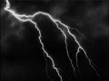

**Universal** | bw

First known occurrence. Released April 19, 1935. Somewhat less bright than later uses. Appears in both left-facing and right-facing (mirrored) versions during the creation sequence.

[YouTube clip](https://youtu.be/lmA0Vm8UFdI)

 

---

## The Raven (1935)

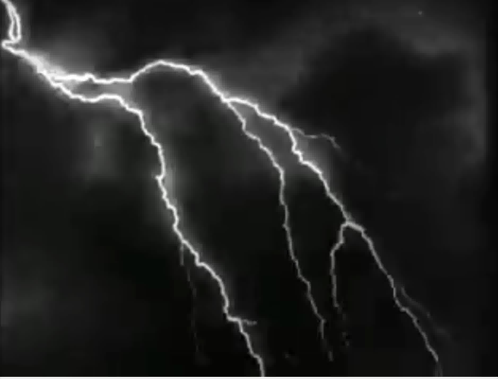

**Universal** | bw

At 39:37, as guests are shown to their rooms. Similar to the *Top Hat* version — both are brighter than the original *Bride* appearance. Visual effects by John P. Fulton. Released July 9, 1935. Uses different clouds than *Bride of Frankenstein*.

 

---

## Top Hat (1935)

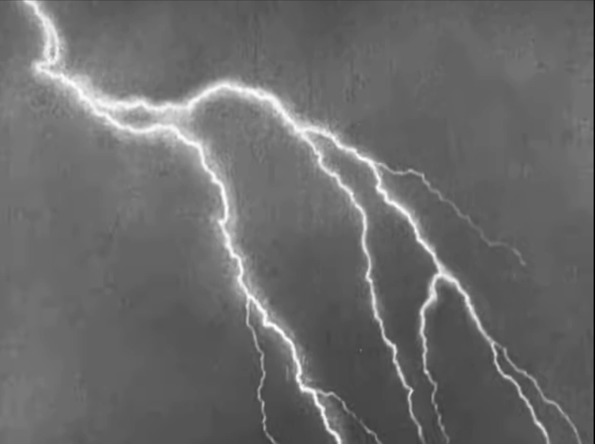

**RKO** | bw

Released August 29, 1935. Appears during the singing-in-the-rain/gazebo sequence. Notable as the earliest non-Universal use — how it got to a rival studio is unknown. Uses the brighter version also seen in *The Raven*.

 

---

## Black Doll (1938)

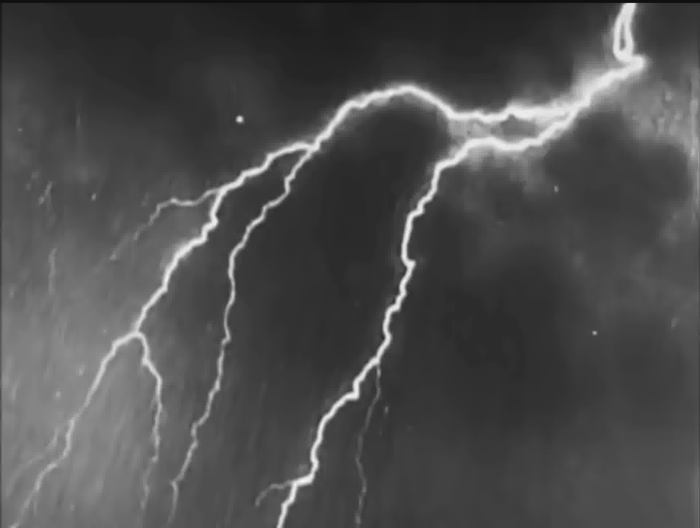

**Universal** | bw

[YouTube link](https://www.youtube.com/watch?v=skyM7zInZjM)

 

---

## Son of Frankenstein (1939)

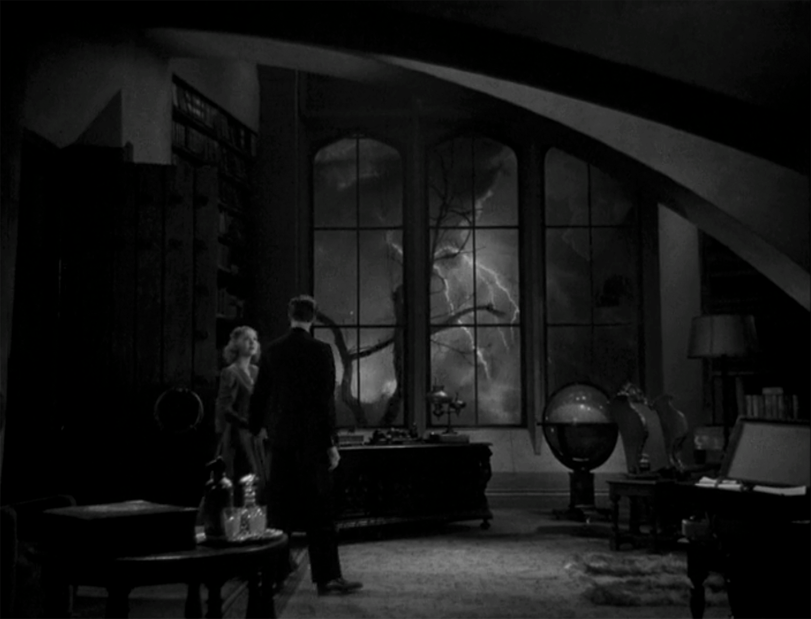

**Universal** | bw

At 11–21 minutes. Rear-projected on set, so the actors could see it. Appears several times. Found directly.

 

---

## The Catman of Paris (1942)

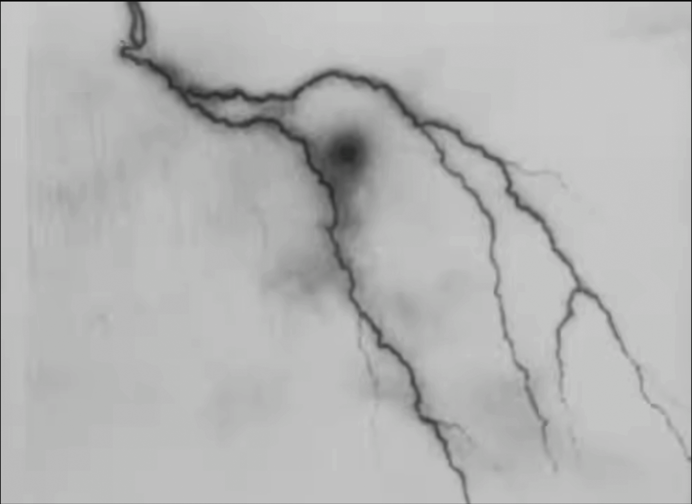

**Republic** | bw

At 0:05:22. Found via Christoph Girardet. Notably, seen in negative!

 

---

## Saboteur (1942)

**Universal**

Hitchcock! At 28:16. Found via Christoph Girardet / Google image search.

---

## Ghost of Frankenstein (1942)

**Universal** | bw

Seen early in the film after the castle is blown up (7:12). Also appears in the trailer. Found directly.

[Trailer on YouTube](https://www.youtube.com/watch?v=ntGhBe2_xg0)

---

## Valley of the Zombies (1946)

**Republic** | bw

Spotted via IMDB photos through Google image search.

---

## Commando Cody: Sky Marshal of the Universe (1953)

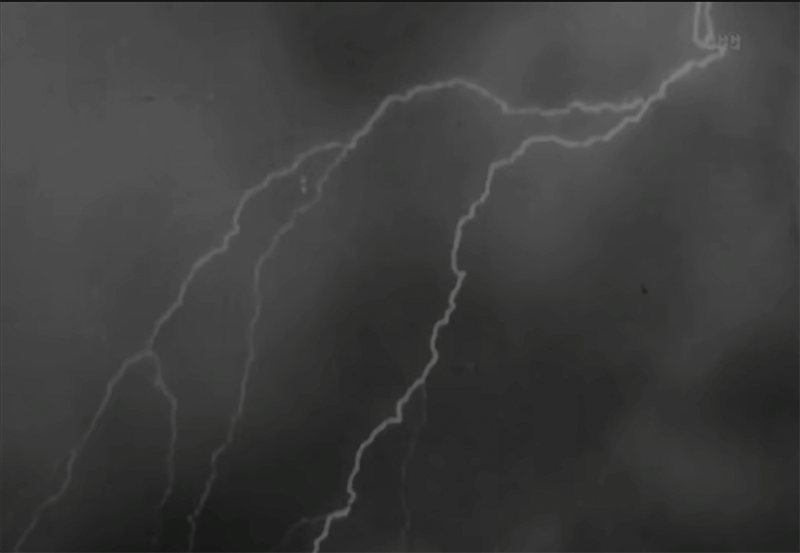

**Republic Pictures** | bw

Serial. Episode 3, after rocket launch (about 21 minutes in). Also at the start of Episode 4, and probably several other episodes. Found directly.

 

---

## Bride of the Monster (1955)

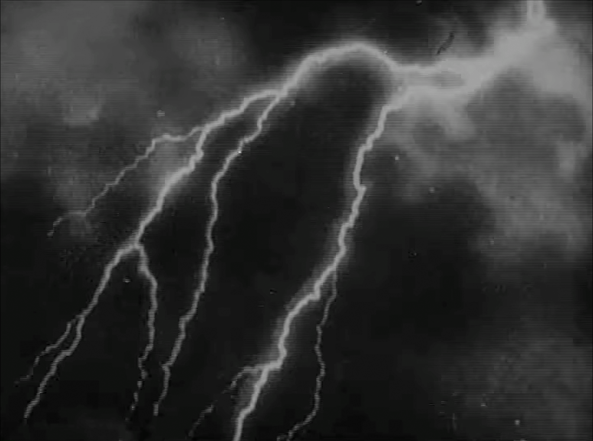

**Rolling M Productions** | bw

After the title card. Ed Wood must have had some fondness for *Bride of Frankenstein* — he stuck this lightning bolt right after his own name.

 

---

## The She Creature (1956)

**American International** | bw

Also spotted by Christoph Girardet.

---

## Attack of the Crab Monsters (1957)

**Los Altos Productions** | bw

Spotted on Reddit by user little_colored_dots. Also found by Christoph Girardet.

---

## Portrait in Black (1960)

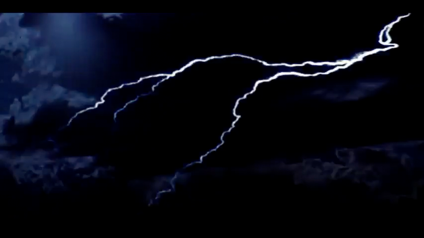

**Universal** | bluesky

At 20:39. From Christoph Girardet. **Earliest known "BlueSky" appearance.** Uncropped, stretched to 2:1 aspect ratio. Directed by Michael Gordon. The scene immediately preceding has odd color cycling (purple to brown) in all versions found — unclear if this is damage or an intentional lighting choice. Found on the Internet Archive.

 

---

## Reptilicus (1961)

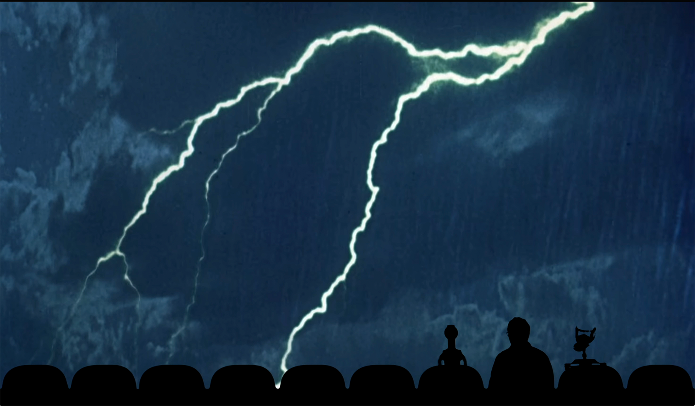

**Saga Studios (Denmark)** | bluesky

Found while watching Netflix — see *MST3K: The Return* S1E1. Uses the BlueSky background plate, but the animation is very simple: a one-second shot with two strobes, possibly working from a still frame of Universal film stock.

 

---

## Twice Told Tales (1963)

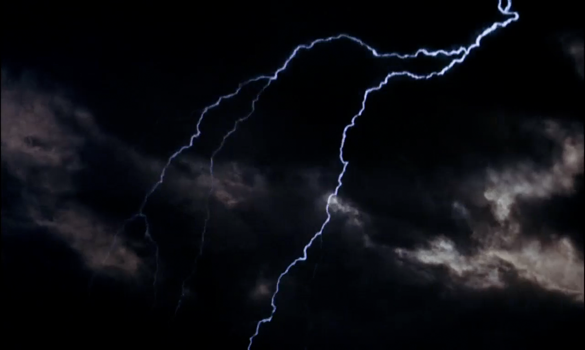

**Admiral Pictures**

At 00:01:43. From Christoph Girardet, found copy on Internet Archive. During the opening Vincent Price narration, one of several lightning bolts over the same cloud background. Not the BlueSky variant.

 

---

## The Thrill of It All (1963)

**Universal** | bluesky

At 1:14:13. 2:1 aspect ratio. From Christoph Girardet.

---

## Gilligan's Island — Unaired Pilot (1964)

**CBS** | bw

Used in the original opening theme. Removed before broadcast, and NOT used in the opening theme during the series. Found via Google Images.

---

## Jesse James Meets Frankenstein's Daughter (1966)

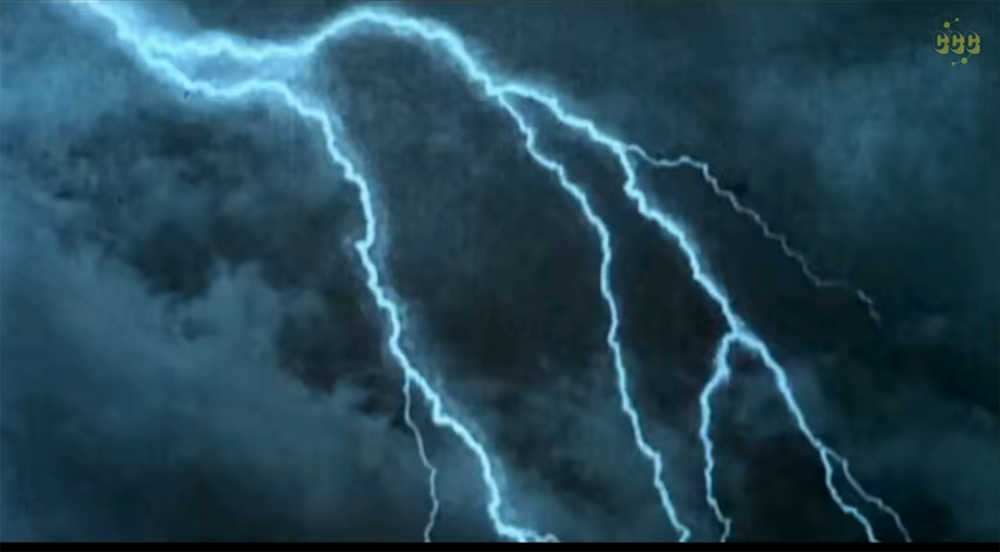

**Embassy Pictures**

First of three appearances at 3:58 (left/right versions). Not BlueSky. Several others throughout the film. A Strickfaden Cosmic Ray Diffuser is visible on set! Found while searching the Kenneth Strickfaden filmography via his biography.

 

---

## The Big Valley, S2E25 "Plunder" (1967)

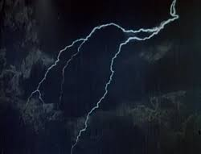

**bluesky**

At the beginning of the episode.

 

---

## The Dunwich Horror (1970)

**Alta Vista / AIP**

Three times beginning at 1:24:50. Produced by Roger Corman.

---

## Dark Shadows, S23E34 — Episodes 1136/1137 (1970)

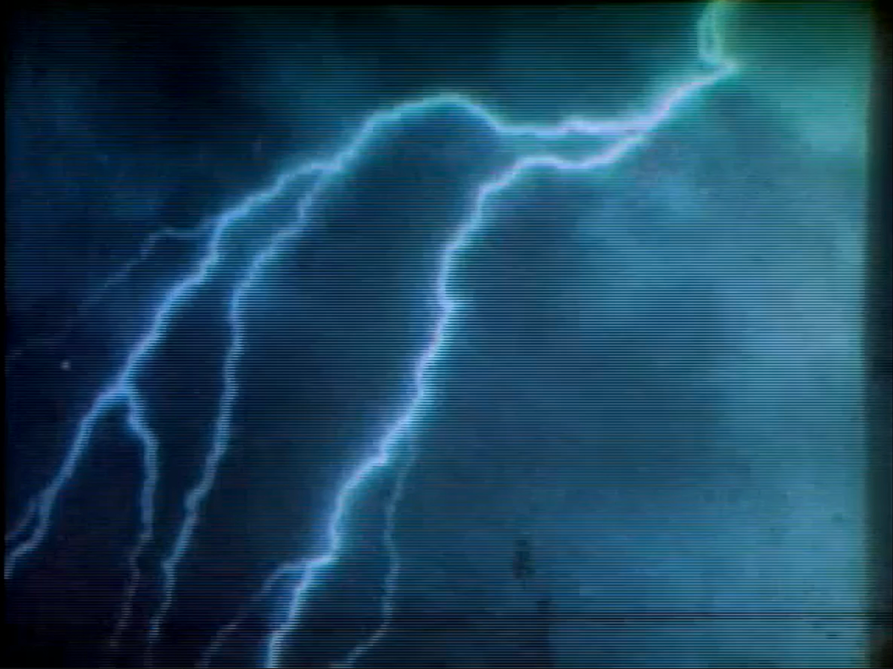

**Dan Curtis Productions**

Not the BlueSky background. Likely appears in several other episodes as well.

 

---

## Lucifer Rising (1972)

Short art film by Kenneth Anger. The bolt is superimposed over another shot.

---

## The Victim (1972)

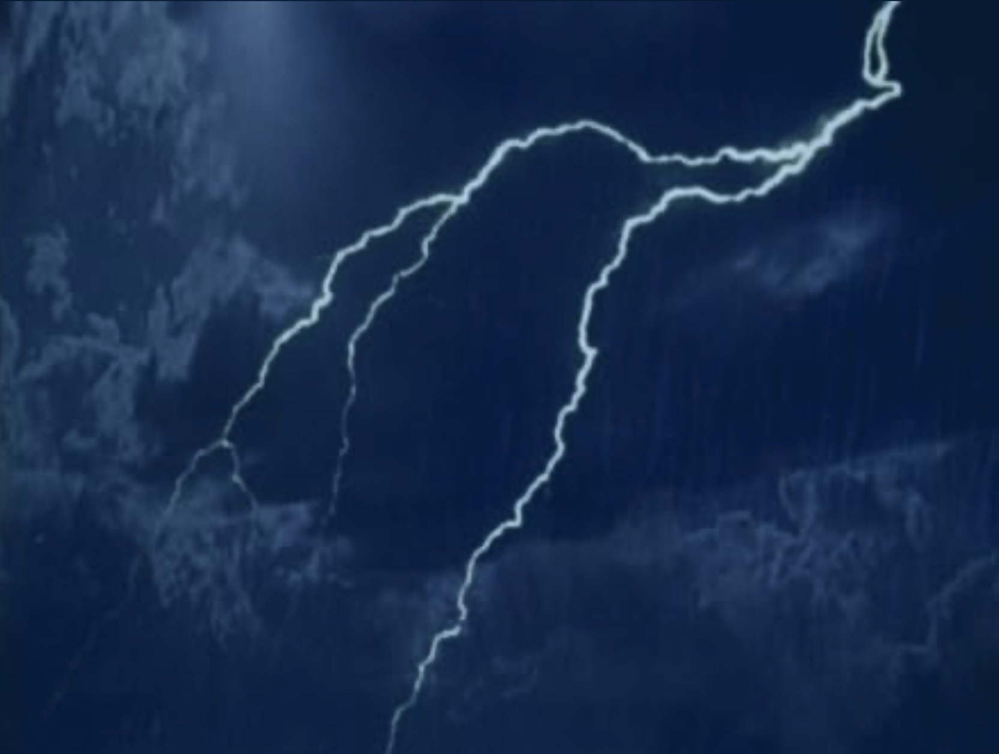

**bluesky**

TV movie starring Elizabeth Montgomery. Image found on IMDB via Google image search. Probably Universal TV?

 

---

## Columbo, S1E6 "Short Fuse" (1972)

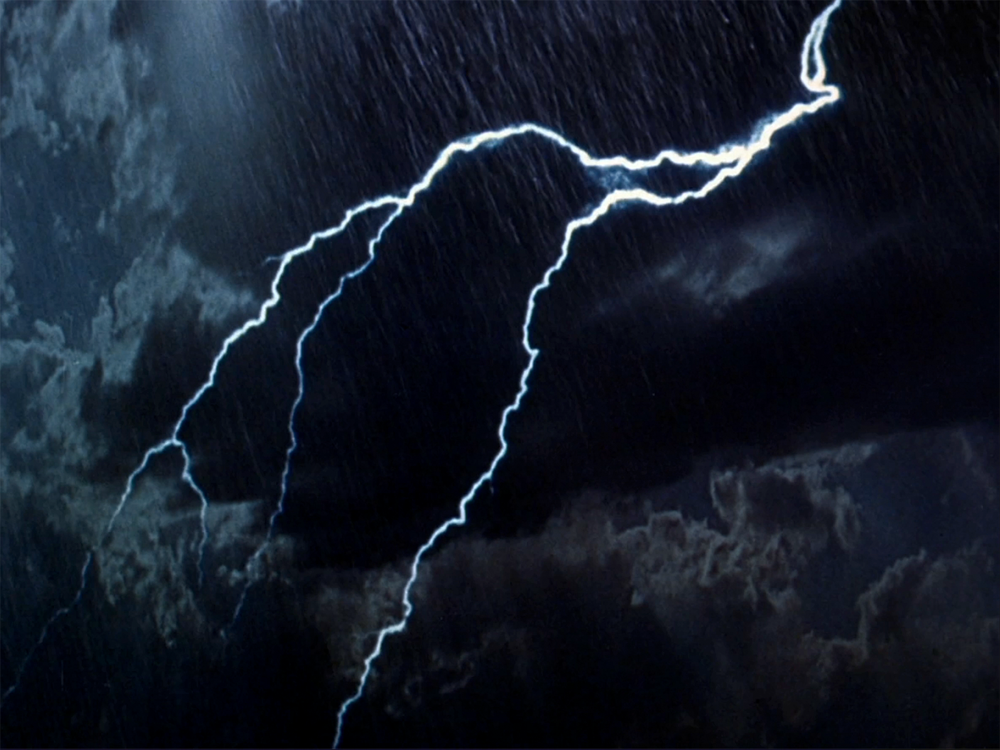

**Universal TV** | bluesky

At 00:14:15. Roddy McDowall in a car smoking a cigar. Found directly.

 

---

## Phantom of the Paradise (1974)

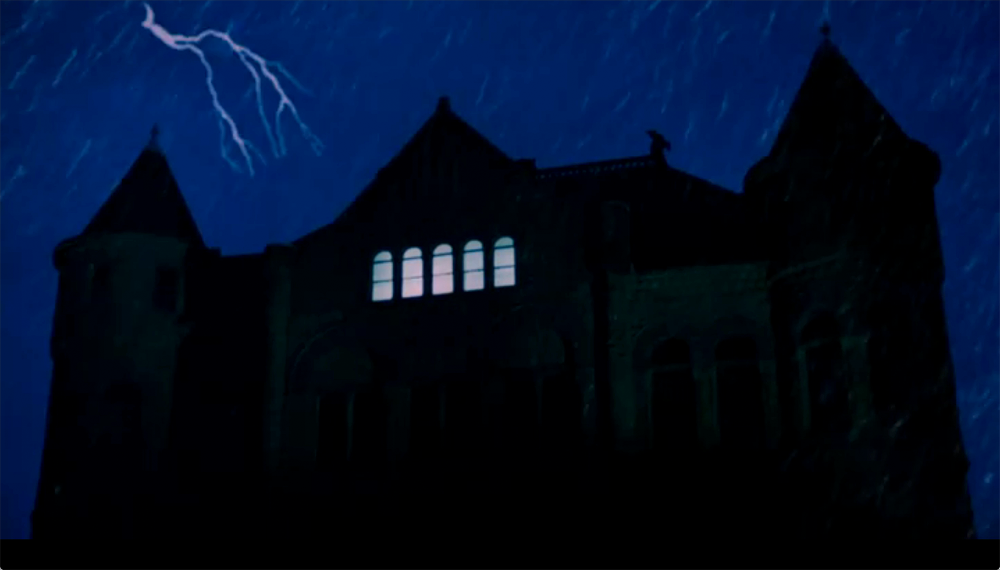

**Harbor Productions**

Seen above Swan's mansion at 1:10:15, possibly elsewhere in the movie. An unusual instance in which it didn't fill the screen — cleverly inserted into a wider shot. Found directly.

 

---

## The Keeper (1976)

**Canadian**

TV movie. At 27:33. Full video on YouTube. Photo is very high contrast — used to represent an electrical shock being used to torture a victim. Found by Christoph Girardet.

---

## The Incredible Hulk (1978)

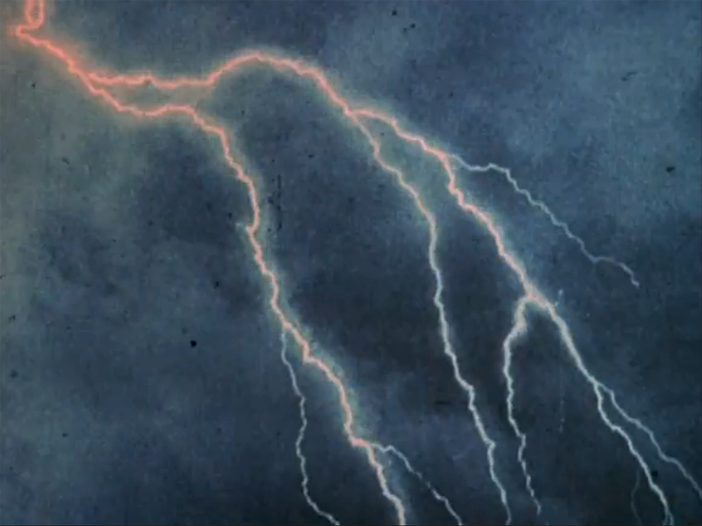

**Universal TV**

Opening credits. Heavily overexposed, with a custom background (not BlueSky). Reused in *She-Hulk* (2022).

 

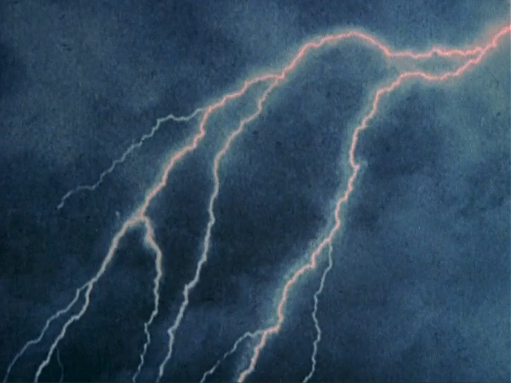

 

---

## The Six Million Dollar Man, S5E18 "Dead Ringer" (1978)

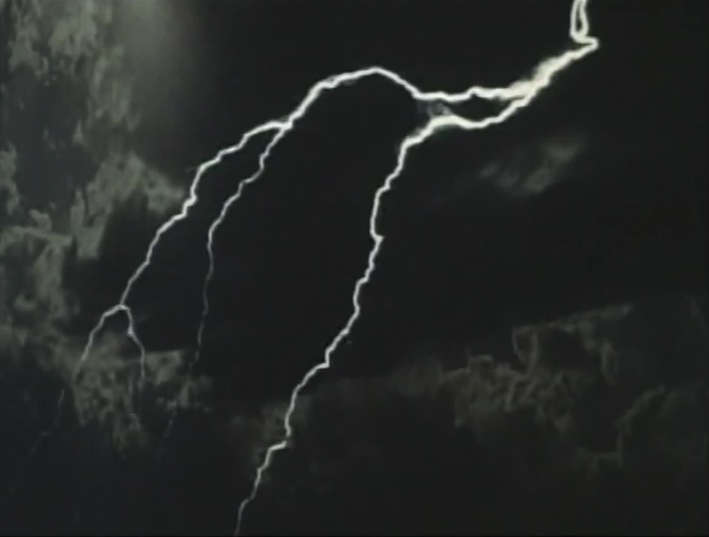

**Universal TV** | bluesky

Opens the episode. Found via TinEye reverse image search.

 

---

## The Incredible Hulk, S2E12 "A Solitary Place" (1979)

**Universal TV** | bluesky

Effect used during the episode, as Hulk saves a woman (Kathryn Leigh Scott) from lightning.

---

## Elvira's Movie Macabre (1981)

**KHJ TV**

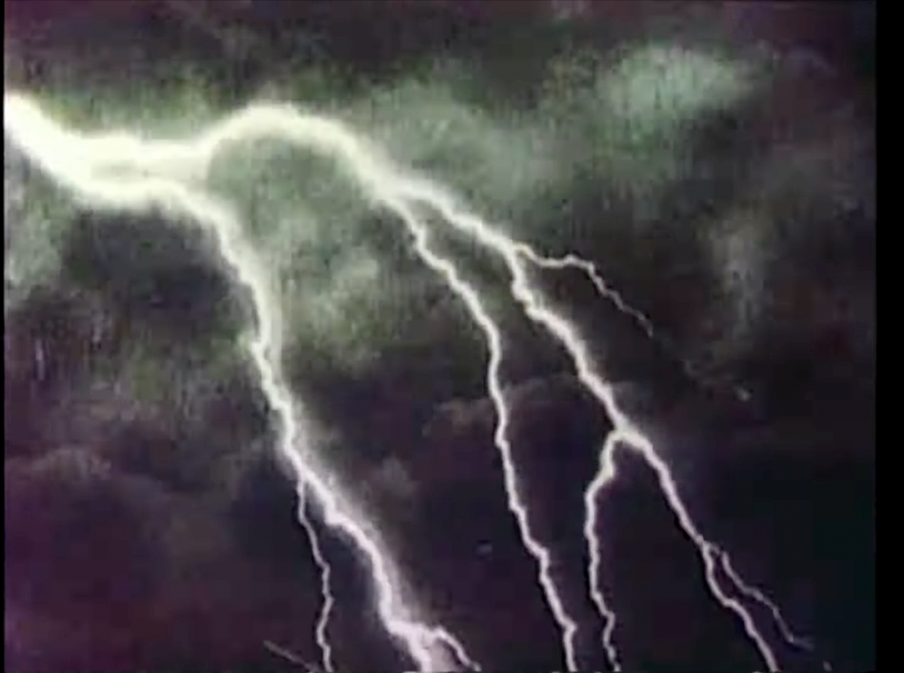

Opening credits, along with other Universal stock footage.

 

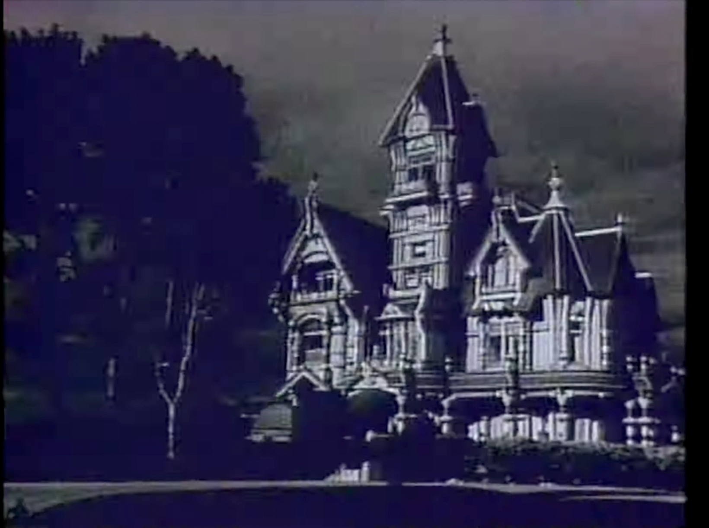

 

---

## Murder, She Wrote, S1E21 "Funeral at Fifty Mile" (1985)

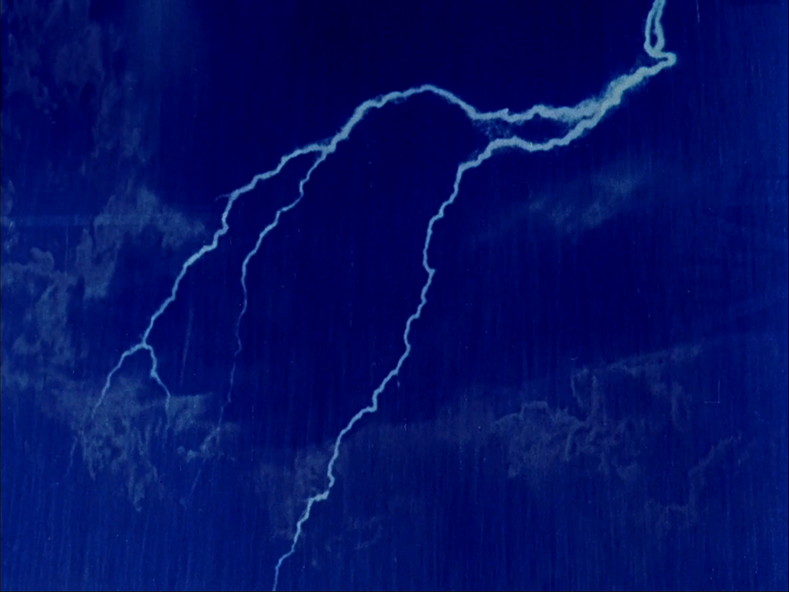

**Universal TV** | bluesky

About one-third into the episode. Found by a Redditor. Depicts a daytime storm.

 

---

## Murder, She Wrote, S2E6 "Reflections of the Mind" (1986)

**Universal TV**

Found by a Redditor. At 00:00 (preview) and 39:03.

---

## Matlock, S1E17 "The Convict" (1987)

**Universal** | bluesky

At 00:02:30. Spotted by Christoph Girardet.

---

## Moonlighting, S3E10 "Poltergeist III: Dipesto Nothing" (1987)

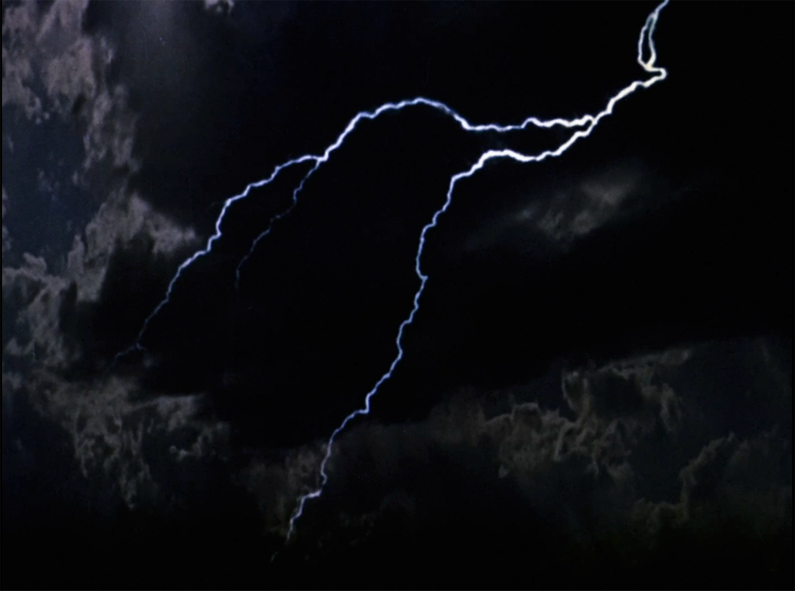

**ABC Circle Films / Picturemaker** | bluesky

Spotted by ridgerooms on Threads. At 21:25 (unreversed) and 22:29 (unreversed).

 

---

## Murder, She Wrote, S3E13 "Crossed Up" (1987)

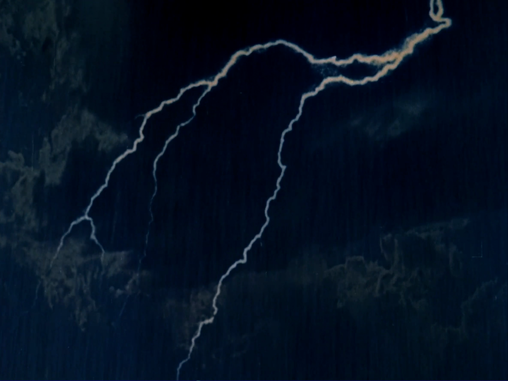

**Universal TV** | bluesky

At 00:04:00. Found by a Redditor.

 

---

## Book of Days (1988)

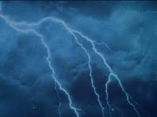

Film by performance artist Meredith Monk. Excerpt on YouTube. Not the BlueSky variant.

 

---

## Murder, She Wrote, S8E6 "Judge Not" (1991)

**Universal** | bluesky

At 8:01. Spotted by Christoph Girardet.

---

## Murder, She Wrote, S8E9 "The Committee" (1991)

**Universal**

At 20:18. Spotted on Threads by canfield_handcrafted_soaps. Also appears in the episode preview.

---

## Murder, She Wrote, S8E12 "The Witches Curse" (1991)

**Universal**

Spotted by jbum. Appears in the preview only. The Munsters mansion makes an appearance in this episode.

---

## Murder, She Wrote, S8E20 "Angel of Death" (1991)

**Universal**

At 34:41. Also in the preview. Spotted by jbum.

---

## Die Entstehung von Gewittern (2015)

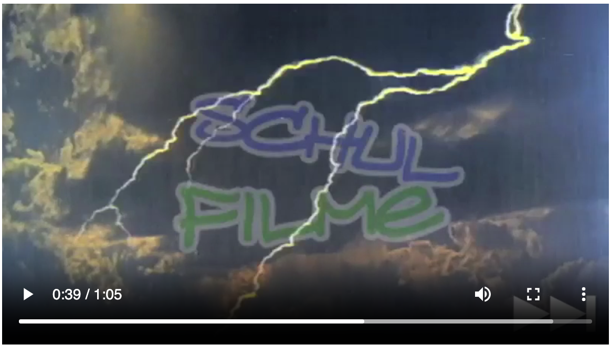

"The Formation of Thunderstorms" — Educational German film. | bluesky

At 00:39. Found via TinEye. Possibly using current Universal stock footage.

[schulfilme.com](https://www.schulfilme.com/filme/gewitter-entstehung.html)

 

---

## Tales of Frankenstein (2018)

**Donald F. Glut**

Self-produced film. Unconfirmed, but Glut says it's in there. He mentioned using the shot "stretched out a bit for widescreen."

---

## She-Hulk: Attorney at Law, S1E9 (2022)

**Disney**

Reuse of the *Incredible Hulk* footage from the 1978 opening credits. Found watching Disney+.  **Last known use in a commercial movie/tv production**
