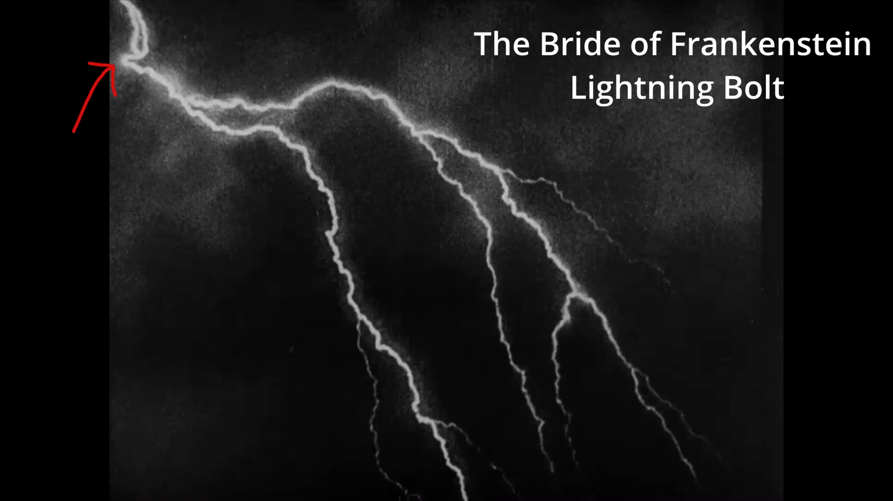

# The Bride of Frankenstein Lightning Bolt Filmography

In 1935, a particular lightning bolt appeared in Universal's *Bride of Frankenstein*. In the nearly 90 years since, this same lightning bolt has been reused in dozens — possibly hundreds — of movies and TV shows. It's the Wilhelm Scream of lightning bolts.

This repository is a filmography of every confirmed appearance, along with research notes and a list of candidates still to investigate.

## Video

## How to Identify It

The bolt has a distinctive shape:

- A characteristic **hook-and-loop** at the top left (or top right, when mirrored)
- A specific branching pattern in the lower portion
- It doesn't move — it only changes in brightness, suggesting it was derived from a photograph or stencil rather than filmed live
- The mirror image is frequently used alongside the original, a common trick to get more mileage out of an expensive effects shot

Starting in the 1960s, a common color variant appears composited with a specific cloud background plate (nicknamed **"BlueSky"**), often tinted blue with rain. This version was widely used in Universal TV shows through the 1990s and remains available in the Universal Stock Footage Library to this day.

## Who Made It?

The origin is debated. Author Donald F. Glut, in *The Frankenstein Catalog* (1984), credited the shot to Kenneth Strickfaden, who supplied the electrical apparatus for the Frankenstein films. Strickfaden personally confirmed this to Glut. However, Glut's earlier book *The Frankenstein Legend* (1973) described it as "real lightning, optically prolonged" without mentioning Strickfaden.

The special photographic effects for *Bride of Frankenstein* were by John P. Fulton, head of Universal's effects department, and his team was more likely responsible for the actual shot. The bolt's appearance — bright at the stem, tapering toward the tips — suggests it may have been photographed from a Tesla coil, possibly one of Strickfaden's devices.

## Contents

- **[FILMOGRAPHY.md](FILMOGRAPHY.md)** — Every confirmed appearance (44 entries, 1935–2022), with stills where available
- **[NOTES.md](NOTES.md)** — Research notes on the bolt's origins, visual characteristics, and the Universal stock footage library
- **[CANDIDATES.md](CANDIDATES.md)** — Films and shows suspected to contain the bolt but not yet confirmed
- **[RULED_OUT.md](RULED_OUT.md)** — Films examined and confirmed to NOT contain the bolt

## Can You Help?

If you've spotted this lightning bolt in a movie or TV show not listed in the filmography, please [open an issue](../../issues)! Include:

- The title and year
- A timecode if you have one
- A screenshot if possible

## Credits

- Research by Jim Bumgardner
- Thanks to **Christoph Girardet**, whose photo series [*Seven Strokes*](http://www.christophgirardet.de/pgs/print_14.html?0) (2008) independently catalogued many appearances
- Thanks to **Bill Paxton** at the Universal Film Library for providing historical context
- Thanks to **Donald F. Glut** for corresponding about the bolt's origins
- Additional sightings contributed by Reddit and Threads users
